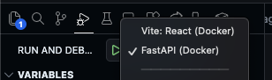
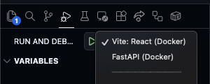

# py-basketball

Objectives

-   Frontend

    -   Libraries
        -   [React](https://react.dev/learn)
        -   [TypeScript](typescriptlang.org/cheatsheets/)
        -   [@tanstack/tanstack-router](https://tanstack.com/router/latest) - Routing
        -   [@tanstack/query](https://tanstack.com/query/latest) - Data retrieval
        -   [zustand](https://github.com/pmndrs/zustand) - Global state
    -   Features
        -   Users
            -   [ ] Sign up page
            -   [ ] Login page
            -   [ ] Home page
        -   Generic features
            -   [ ] Watching players (tracking trends for specific players)
                -   [ ] Render playerlist
                -   [ ] Call backend service for updating watchlist
            -   [x] List of trending players in the NBA
                -   [x] Filter tag selector
        -   Yahoo API
            -   [ ] Prompt user to connect Yahoo account
            -   [ ] Show current matchup
            -   [ ] Show list of trending players based on league settings
            -   [ ] Dashboard
                -   [ ] Today's games
                -   [ ] Waiver board
                -   [ ] Category tracker

-   Backend
    -   Selenium (Proof of concept, will not be used in production)
        -   [x] Scrape data from [basketball-reference](https://www.basketball-reference.com/friv/dailyleaders.fcgi?month=11&day=17&year=2025) for player stats
        -   [x] Scrape data from [basketball-reference](https://www.basketball-reference.com/allstar/202502162NBA.html) for list of all stars
    -   External Services
        -   [x] Retrieve upcoming NBA schedule for the next N days
        -   [x] Retrieve player stats from NBA API
    -   Supabase
        -   [x] player_data table - Saved player statistics
        -   [x] saved_dates table - Indicates which dates have already been scraped
        -   [x] analysis_status table - Save process status for projected analysis
        -   [x] analysis_data table - Save data for projected analysis
        -   [x] trending_analysis_status table - Save process status for trending analysis
        -   [x] trending_analysis_data table - Save data for trending analysis
        -   [x] Supabase functions for grabbing all/average/totals of player stats from the last N days
    -   [ ] Use AI for player analysis (trends and projections)
        -   [x] Google Gemini
            -   [ ] Determine work around for January 2025 knowledge cut off
                -   [x] Pull list of all stars for recent years
            -   [ ] Feed entire season data set for all players and schedule (Will need to workaround API Limits)
                -   [ ] Use different AI API?
        -   [x] Feed statistics from the last N days
        -   [x] Get projected statistics for the next N days
        -   [x] Get trending players from the past N days
            -   [ ] Add parameters for filters
            -   [ ] Player tags
                -   [ ] Injury
                -   [x] Minutes Up
                -   [x] Stocks
                -   [ ] Usage
        -   [x] Incorporate upcoming NBA schedule
            -   [x] Get number of games for next N days
            -   [x] Get list of opponents for next N days
    -   [x] Automation
        -   [x] Pull data once per day and cache pervious analysis results
        -   [x] Run analysis daily at midnight with GitHub actions
            -   [x] Create dockerfile and actions workflow for calling process_daily_players.py
    -   [ ] fastapi routes for:
        -   [ ] Authentication - require Supabase JWT token to access routes
        -   [ ] Accessing player statistics
            -   [x] Projected players for the next N days
            -   [x] Player averages from last N days
            -   [x] ProjectedAnalysis for the next N days
            -   [x] Trending players from last N days
            -   [x] Fantasy score calculation
                -   [x] Create exclusion list based off fantasy scores
        -   [ ] Passing specific criteria for analysis (Dependent on API rate limits (Too much data?))
        -   [ ] Personalized analysis for current user
            -   [ ] Watch list
    -   [ ] Yahoo API
        -   [ ] Link user account to Yahoo fantasy league
            -   [ ] OAuth and Yahoo Developer API
        -   [ ] Exclude highest rostered players from analysis
        -   [ ] Analyze current user matchup

## Installation

Install the following

-   [Node Package Manager](https://www.npmjs.com/)
-   [Python package manager](https://pip.pypa.io/en/stable/)
-   [Docker Desktop](https://www.docker.com/)

Create an .env file in the root directory with the folllowing contents:

```properties
DEV=True
VITE_CLIENT_URL=http://localhost:3000/
VITE_SERVER_URL=http://localhost:3300/api
SUPABASE_URL=YOUR_SUPABASE_URL_HERE
SUPABASE_KEY=YOUR_SUPABASE_KEY_HERE
SUPABASE_JWT_SECRET=YOUR_SUPABASE_JWT_SECRET_HERE
GEMINI_API_KEY=YOUR_GEMINI_API_KEY_HERE
PYTHONPATH=./src/server
```

Run the following in the `py-basketball` directory

```bash
git clone https://github.com/mlmar/py-basketball
cd py-basketball

make install
```

## Development and Debugging in VSCode

In the `py-basketball` directory, run the following in the terminal:

```bash
make run
```

This will launch the Docker container for both the server and client.
All dependencies should be installed. Ignore frozen module warnings.

While development Docker container is running, navigate to the Run and Debug panel.

**Attach to the Python FastAPI server to run it.**



Attach to the React Vite server:



## Production

Set the following env properties

```properties
VITE_CLIENT_URL=https://PRODUCTION_URL.com
VITE_SERVER_URL=https://PRODUCTION_URL.com/api
```

Production

```bash
docker build .
```
